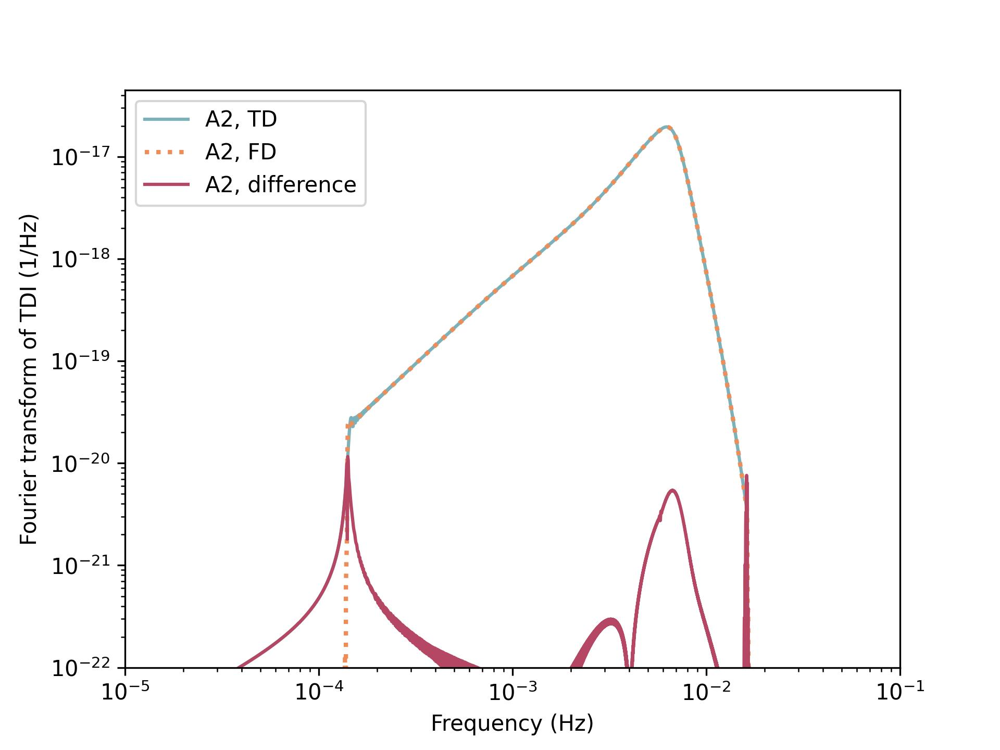

# Triangle-BBH
Frequency-domain BBH TDI-2.0 response template and basic analysis tools, including the TDI-2.0 response wrappers of 2 waveforms: (1) the IMRPhenomD \& HM waveform of [BBHx](https://github.com/mikekatz04/BBHx) (CPU \& GPU) and (2) the  IMRPhenomD \& HM waveform of [WF4PY](https://github.com/CosmoStatGW/WF4Py) (CPU only). 
The responses are consistent with the time-domain simulations of **Triangle-Simulator** (see example 3). 
This code offers an illustrative example (example 4) for the preliminary analysis of **Taiji Data Challenge**, and should not be regarded as a solution to all the challenges.
Besides, example 0-2 might be useful for the researchers who are interested in studying GW sciences with Bayesian method.  

# Installation 
1. install [Triangle-Simulator](https://github.com/TriangleDataCenter/Triangle-Simulator) 

2. install modified `WF4PY` (if use WF4PY CPU waveform): 

```bash
   cd WF4PY 
   python setup.py install --user  
```

3. install `BBHx` (if use `BBHx` GPU waveform)  
   
   follow the [instructions of BBHx](https://mikekatz04.github.io/BBHx/html/index.html).   

4. install MCMC tools to run the notebooks: 

```bash
   pip install eryn corner  
```

5. install Triangle_BBH 

```bash   
   pip install -e . (or python setup.py install --user)
```

# Comparison with time-domain simulation 


# References
(Please make sure to cite BBHx or WF4PY if Triangle-BBH is used in your published research).

- Taiji Data Challenge \& Triangle: [the TDC \& Triangle paper](TBD)
- The frequency-domain detector response formalism of inspiral-merger-ringdown waveforms for space-based detectors: [S. Marsat et al, arXiv:1806.10734](https://arxiv.org/abs/1806.10734), [S. Marsat et al, Phys. Rev. D 103, 083011 (2021)](https://doi.org/10.1103/PhysRevD.103.083011)
- BBHx: [BBHx documentations](https://mikekatz04.github.io/BBHx/html/index.html)
- WF4PY: [WF4PY documentations](https://wf4py.readthedocs.io/en/latest/index.html)
